# Mermaid Cho Các Hàm Ghi State Và Tốn Gas

Tài liệu này chuyển các dataflow chữ trong `GAS_WRITE_DATAFLOW.md` thành sơ đồ Mermaid. Mỗi chức năng có một flowchart riêng, ưu tiên thể hiện:

- caller hoặc actor khởi tạo flow
- lớp điều phối `VoucherProtocol`
- library xử lý thực tế nếu có delegatecall
- nhánh kiểm tra chính
- storage bị ghi
- event hoặc side effect ETH

## 1. Tenant Governance

### `createTenant`

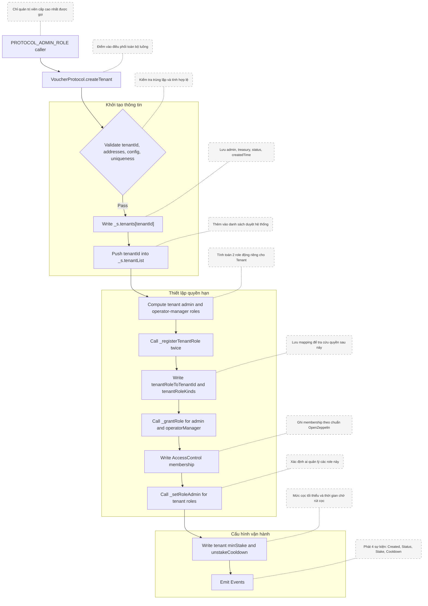
```mermaid
flowchart TD
    %% Định nghĩa các bước chính
    A[PROTOCOL_ADMIN_ROLE caller] --> B[VoucherProtocol.createTenant]
    B --> C{Validate tenantId, addresses, config, uniqueness}

    subgraph Storage_Basic [Khởi tạo thông tin]
        C -->|Pass| D["Write _s.tenants[tenantId]"]
        D --> E[Push tenantId into _s.tenantList]
    end

    subgraph RBAC_Setup [Thiết lập quyền hạn]
        E --> F[Compute tenant admin and operator-manager roles]
        F --> G[Call _registerTenantRole twice]
        G --> H[Write tenantRoleToTenantId and tenantRoleKinds]
        H --> I[Call _grantRole for admin and operatorManager]
        I --> J[Write AccessControl membership]
        J --> K[Call _setRoleAdmin for tenant roles]
    end

    subgraph Config_Final [Cấu hình vận hành]
        K --> L[Write tenant minStake and unstakeCooldown]
        L --> M[Emit Events]
    end

    %% Ghi chú chi tiết bằng nét đứt
    N1(Chỉ quản trị viên cấp cao nhất được gọi) -.- A
    N2(Điểm vào điều phối toàn bộ luồng) -.- B
    N3(Kiểm tra trùng lặp và tính hợp lệ) -.- C
    N4(Lưu admin, treasury, status, createdTime) -.- D
    N5(Thêm vào danh sách duyệt hệ thống) -.- E
    N6(Tính toán 2 role động riêng cho Tenant) -.- F
    N7(Lưu mapping để tra cứu quyền sau này) -.- H
    N8(Ghi membership theo chuẩn OpenZeppelin) -.- J
    N9(Xác định ai quản lý các role này) -.- K
    N10(Mức cọc tối thiểu và thời gian chờ rút cọc) -.- L
    N11(Phát 4 sự kiện: Created, Status, Stake, Cooldown) -.- M

    %% Style cho các ghi chú
    classDef note fill:#f5f5f5,stroke:#999,stroke-dasharray: 5 5,font-size:12px;
    class N1,N2,N3,N4,N5,N6,N7,N8,N9,N10,N11 note
```

> Quản trị viên hệ thống khởi tạo một đơn vị vận hành mới (tenant) trên nền tảng. Hành động này tương đương với việc "mở tài khoản doanh nghiệp" — hệ thống ghi nhận thông tin quản trị, kho tiền, các cấu hình vận hành, và trao quyền cho người quản lý tenant ngay từ đầu. Sau bước này, tenant đã sẵn sàng để tuyển operator và phát hành voucher.

### `setTenantStatus`

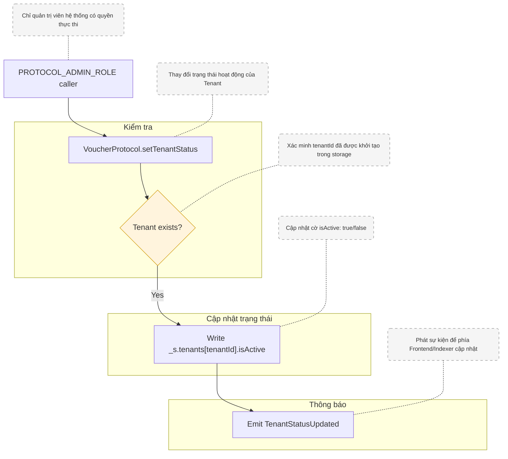
```mermaid
flowchart TD
    %% Định nghĩa các bước chính
    A[PROTOCOL_ADMIN_ROLE caller] --> B[VoucherProtocol.setTenantStatus]

    subgraph Validation [Kiểm tra]
        B --> C{Tenant exists?}
    end

    subgraph State_Update [Cập nhật trạng thái]
        C -->|Yes| D["Write _s.tenants[tenantId].isActive"]
    end

    subgraph Events [Thông báo]
        D --> E[Emit TenantStatusUpdated]
    end

    %% Ghi chú chi tiết bằng nét đứt
    N1(Chỉ quản trị viên hệ thống có quyền thực thi) -.- A
    N2(Thay đổi trạng thái hoạt động của Tenant) -.- B
    N3(Xác minh tenantId đã được khởi tạo trong storage) -.- C
    N4(Cập nhật cờ isActive: true/false) -.- D
    N5(Phát sự kiện để phía Frontend/Indexer cập nhật) -.- E

    %% Style cho các ghi chú
    classDef note fill:#f5f5f5,stroke:#999,stroke-dasharray: 5 5,font-size:12px;
    class N1,N2,N3,N4,N5 note

    %% Style cho logic
    style C fill:#fff4dd,stroke:#d4a017
```

> Quản trị viên hệ thống bật hoặc tắt hoạt động của một tenant. Khi tenant bị tắt, toàn bộ các giao dịch phát sinh từ tenant đó sẽ không được xử lý, tương tự như "đóng băng tài khoản doanh nghiệp" tạm thời hoặc vĩnh viễn.

## 2. Operator Lifecycle

### `joinAsOperator`

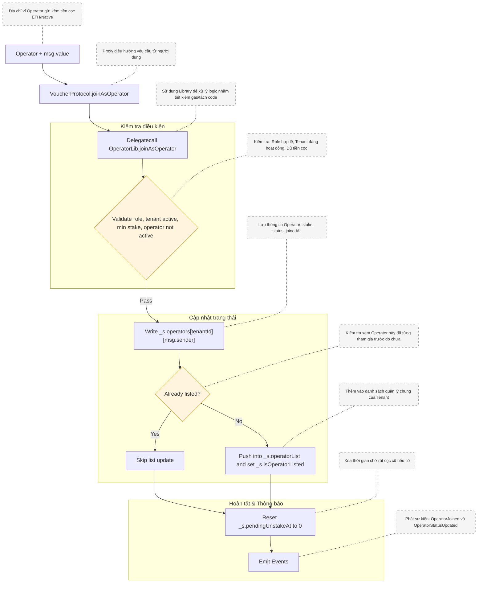
```mermaid
flowchart TD
    %% Định nghĩa các bước chính
    A[Operator + msg.value] --> B[VoucherProtocol.joinAsOperator]
    B --> C[Delegatecall OperatorLib.joinAsOperator]

    subgraph Validation [Kiểm tra điều kiện]
        C --> D{Validate role, tenant active, min stake, operator not active}
    end

    subgraph Operator_State [Cập nhật trạng thái]
        D -->|Pass| E["Write _s.operators[tenantId][msg.sender]"]
        E --> F{Already listed?}
        F -->|No| G[Push into _s.operatorList and set _s.isOperatorListed]
        F -->|Yes| H[Skip list update]
    end

    subgraph Finalize [Hoàn tất & Thông báo]
        G --> I[Reset _s.pendingUnstakeAt to 0]
        H --> I
        I --> J[Emit Events]
    end

    %% Ghi chú chi tiết bằng nét đứt
    N1(Địa chỉ ví Operator gửi kèm tiền cọc ETH/Native) -.- A
    N2(Proxy điều hướng yêu cầu từ người dùng) -.- B
    N3(Sử dụng Library để xử lý logic nhằm tiết kiệm gas/tách code) -.- C
    N4(Kiểm tra: Role hợp lệ, Tenant đang hoạt động, Đủ tiền cọc) -.- D
    N5(Lưu thông tin Operator: stake, status, joinedAt) -.- E
    N6(Kiểm tra xem Operator này đã từng tham gia trước đó chưa) -.- F
    N7(Thêm vào danh sách quản lý chung của Tenant) -.- G
    N8(Xóa thời gian chờ rút cọc cũ nếu có) -.- I
    N9(Phát sự kiện: OperatorJoined và OperatorStatusUpdated) -.- J

    %% Style cho các ghi chú
    classDef note fill:#f5f5f5,stroke:#999,stroke-dasharray: 5 5,font-size:12px;
    class N1,N2,N3,N4,N5,N6,N7,N8,N9 note

    %% Style cho logic
    style D fill:#fff4dd,stroke:#d4a017
    style F fill:#fff4dd,stroke:#d4a017
```

> Một cá nhân hoặc tổ chức muốn trở thành operator của một tenant phải nộp một khoản tiền đặt cọc (stake) để đăng ký. Khoản cọc này thể hiện cam kết vận hành nghiêm túc và là điều kiện để được phép ký xác nhận tài liệu. Sau bước này, operator chính thức được ghi nhận trong danh sách hoạt động của tenant.

### `topUpStake`

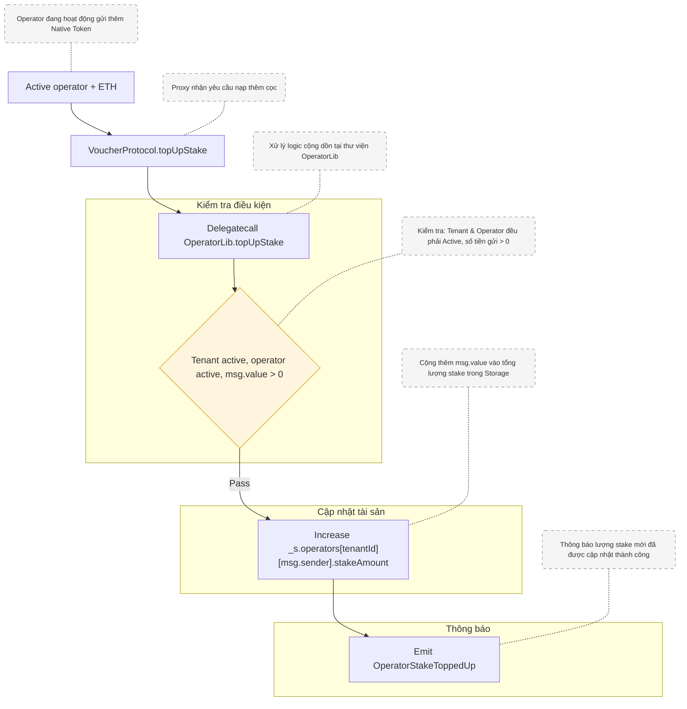
```mermaid
flowchart TD
    %% Định nghĩa các bước chính
    A[Active operator + ETH] --> B[VoucherProtocol.topUpStake]
    B --> C[Delegatecall OperatorLib.topUpStake]

    subgraph Validation [Kiểm tra điều kiện]
        C --> D{Tenant active, operator active, msg.value > 0}
    end

    subgraph Stake_Update [Cập nhật tài sản]
        D -->|Pass| E["Increase _s.operators[tenantId][msg.sender].stakeAmount"]
    end

    subgraph Finalize [Thông báo]
        E --> F[Emit OperatorStakeToppedUp]
    end

    %% Ghi chú chi tiết bằng nét đứt
    N1(Operator đang hoạt động gửi thêm Native Token) -.- A
    N2(Proxy nhận yêu cầu nạp thêm cọc) -.- B
    N3(Xử lý logic cộng dồn tại thư viện OperatorLib) -.- C
    N4(Kiểm tra: Tenant & Operator đều phải Active, số tiền gửi > 0) -.- D
    N5(Cộng thêm msg.value vào tổng lượng stake trong Storage) -.- E
    N6(Thông báo lượng stake mới đã được cập nhật thành công) -.- F

    %% Style cho các ghi chú
    classDef note fill:#f5f5f5,stroke:#999,stroke-dasharray: 5 5,font-size:12px;
    class N1,N2,N3,N4,N5,N6 note

    %% Style cho logic
    style D fill:#fff4dd,stroke:#d4a017
```

> Operator đang hoạt động nạp thêm tiền cọc vào tài khoản của mình, ví dụ để đáp ứng yêu cầu nâng mức cọc tối thiểu hoặc chủ động tăng uy tín vận hành.

### `updateOperatorMetadata`

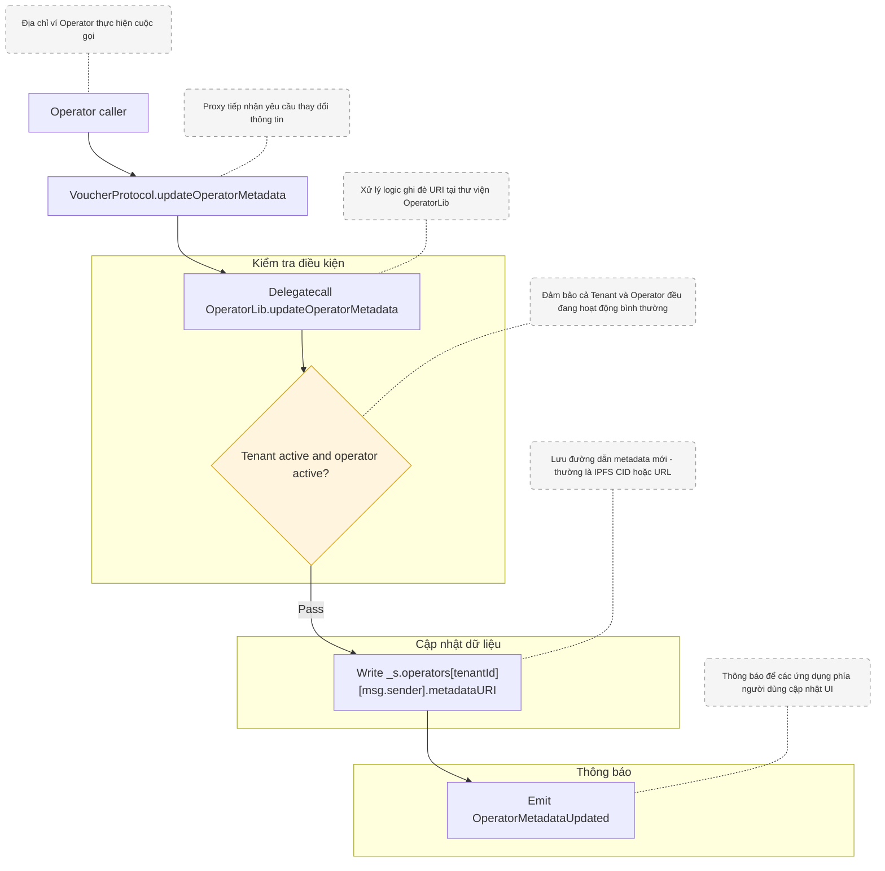
```mermaid
flowchart TD
    %% Định nghĩa các bước chính
    A[Operator caller] --> B[VoucherProtocol.updateOperatorMetadata]
    B --> C[Delegatecall OperatorLib.updateOperatorMetadata]

    subgraph Validation [Kiểm tra điều kiện]
        C --> D{Tenant active and operator active?}
    end

    subgraph Metadata_Update [Cập nhật dữ liệu]
        D -->|Pass| E["Write _s.operators[tenantId][msg.sender].metadataURI"]
    end

    subgraph Finalize [Thông báo]
        E --> F[Emit OperatorMetadataUpdated]
    end

    %% Ghi chú chi tiết bằng nét đứt
    N1(Địa chỉ ví Operator thực hiện cuộc gọi) -.- A
    N2(Proxy tiếp nhận yêu cầu thay đổi thông tin) -.- B
    N3(Xử lý logic ghi đè URI tại thư viện OperatorLib) -.- C
    N4(Đảm bảo cả Tenant và Operator đều đang hoạt động bình thường) -.- D
    N5(Lưu đường dẫn metadata mới - thường là IPFS CID hoặc URL) -.- E
    N6(Thông báo để các ứng dụng phía người dùng cập nhật UI) -.- F

    %% Style cho các ghi chú
    classDef note fill:#f5f5f5,stroke:#999,stroke-dasharray: 5 5,font-size:12px;
    class N1,N2,N3,N4,N5,N6 note

    %% Style cho logic
    style D fill:#fff4dd,stroke:#d4a017
```

> Operator cập nhật thông tin hồ sơ của mình (ví dụ: tên, mô tả, website). Đây là thao tác hành chính đơn giản, không ảnh hưởng đến trạng thái hoạt động hay số tiền cọc.

### `requestUnstake`

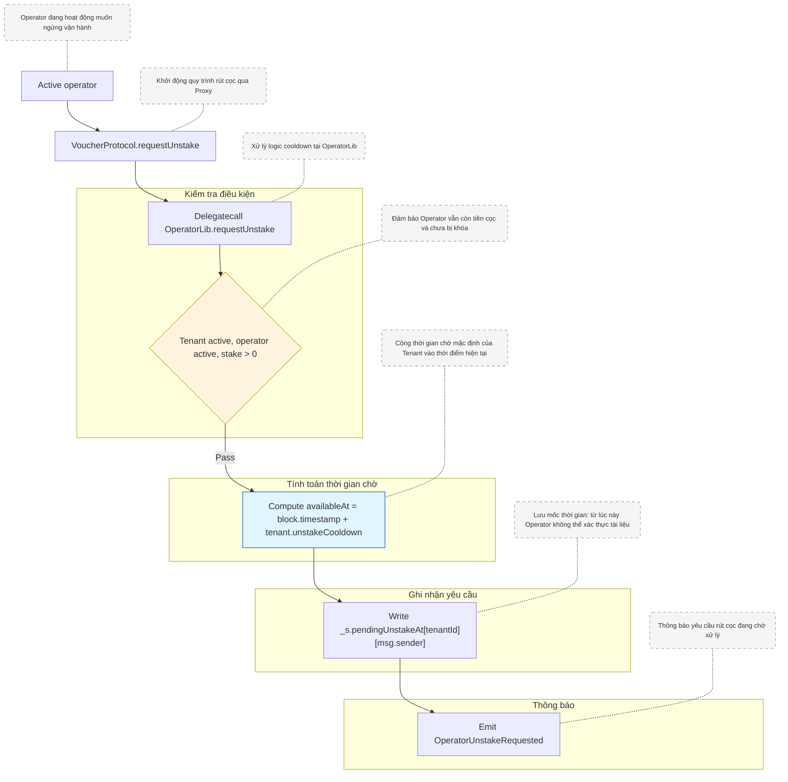
```mermaid
flowchart TD
    %% Định nghĩa các bước chính
    A[Active operator] --> B[VoucherProtocol.requestUnstake]
    B --> C[Delegatecall OperatorLib.requestUnstake]

    subgraph Validation [Kiểm tra điều kiện]
        C --> D{Tenant active, operator active, stake > 0}
    end

    subgraph Cooldown_Logic [Tính toán thời gian chờ]
        D -->|Pass| E[Compute availableAt = block.timestamp + tenant.unstakeCooldown]
    end

    subgraph State_Update [Ghi nhận yêu cầu]
        E --> F["Write _s.pendingUnstakeAt[tenantId][msg.sender]"]
    end

    subgraph Finalize [Thông báo]
        F --> G[Emit OperatorUnstakeRequested]
    end

    %% Ghi chú chi tiết bằng nét đứt
    N1(Operator đang hoạt động muốn ngừng vận hành) -.- A
    N2(Khởi động quy trình rút cọc qua Proxy) -.- B
    N3(Xử lý logic cooldown tại OperatorLib) -.- C
    N4(Đảm bảo Operator vẫn còn tiền cọc và chưa bị khóa) -.- D
    N5(Cộng thời gian chờ mặc định của Tenant vào thời điểm hiện tại) -.- E
    N6(Lưu mốc thời gian: từ lúc này Operator không thể xác thực tài liệu) -.- F
    N7(Thông báo yêu cầu rút cọc đang chờ xử lý) -.- G

    %% Style cho các ghi chú
    classDef note fill:#f5f5f5,stroke:#999,stroke-dasharray: 5 5,font-size:12px;
    class N1,N2,N3,N4,N5,N6,N7 note

    %% Style cho logic
    style D fill:#fff4dd,stroke:#d4a017
    style E fill:#e1f5fe,stroke:#01579b
```

> Operator gửi yêu cầu rút tiền cọc để chuẩn bị rời khỏi hệ thống. Yêu cầu này không được xử lý ngay — hệ thống ghi nhận thời điểm có thể rút dựa trên thời gian chờ (cooldown) mà tenant đã cấu hình, giúp ngăn chặn rút tiền đột ngột trong khi còn giao dịch cần xử lý.

### `executeUnstake`

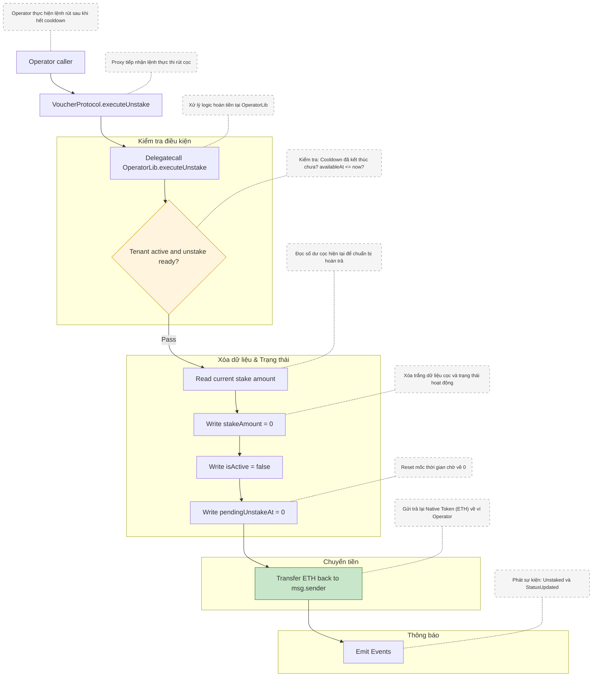
```mermaid
flowchart TD
    %% Định nghĩa các bước chính
    A[Operator caller] --> B[VoucherProtocol.executeUnstake]
    B --> C[Delegatecall OperatorLib.executeUnstake]

    subgraph Validation [Kiểm tra điều kiện]
        C --> D{Tenant active and unstake ready?}
    end

    subgraph State_Reset [Xóa dữ liệu & Trạng thái]
        D -->|Pass| E[Read current stake amount]
        E --> F[Write stakeAmount = 0]
        F --> G[Write isActive = false]
        G --> H[Write pendingUnstakeAt = 0]
    end

    subgraph Fund_Transfer [Chuyển tiền]
        H --> I[Transfer ETH back to msg.sender]
    end

    subgraph Finalize [Thông báo]
        I --> J[Emit Events]
    end

    %% Ghi chú chi tiết bằng nét đứt
    N1("Operator thực hiện lệnh rút sau khi hết cooldown") -.- A
    N2("Proxy tiếp nhận lệnh thực thi rút cọc") -.- B
    N3("Xử lý logic hoàn tiền tại OperatorLib") -.- C
    N4("Kiểm tra: Cooldown đã kết thúc chưa? availableAt <= now?") -.- D
    N5("Đọc số dư cọc hiện tại để chuẩn bị hoàn trả") -.- E
    N6("Xóa trắng dữ liệu cọc và trạng thái hoạt động") -.- F
    N7("Reset mốc thời gian chờ về 0") -.- H
    N8("Gửi trả lại Native Token (ETH) về ví Operator") -.- I
    N9("Phát sự kiện: Unstaked và StatusUpdated") -.- J

    %% Style cho các ghi chú
    classDef note fill:#f5f5f5,stroke:#999,stroke-dasharray: 5 5,font-size:12px;
    class N1,N2,N3,N4,N5,N6,N7,N8,N9 note

    %% Style cho logic
    style D fill:#fff4dd,stroke:#d4a017
    style I fill:#c8e6c9,stroke:#2e7d32
```

> Sau khi hết thời gian chờ, operator thực hiện rút toàn bộ tiền cọc về ví của mình và chính thức ngừng hoạt động. Đây là bước kết thúc quy trình rút cọc đã khởi tạo trước đó.

### `setOperatorStatus`

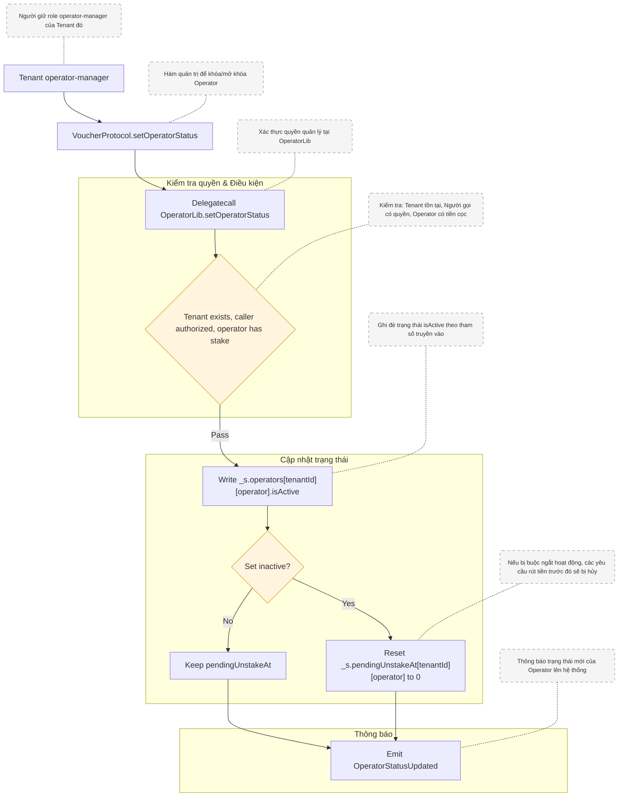
```mermaid
flowchart TD
    %% Định nghĩa các bước chính
    A[Tenant operator-manager] --> B[VoucherProtocol.setOperatorStatus]
    B --> C[Delegatecall OperatorLib.setOperatorStatus]

    subgraph Validation [Kiểm tra quyền & Điều kiện]
        C --> D{Tenant exists, caller authorized, operator has stake}
    end

    subgraph Status_Update [Cập nhật trạng thái]
        D -->|Pass| E["Write _s.operators[tenantId][operator].isActive"]
        E --> F{Set inactive?}
        F -->|Yes| G["Reset _s.pendingUnstakeAt[tenantId][operator] to 0"]
        F -->|No| H[Keep pendingUnstakeAt]
    end

    subgraph Finalize [Thông báo]
        G --> I[Emit OperatorStatusUpdated]
        H --> I
    end

    %% Ghi chú chi tiết bằng nét đứt
    N1(Người giữ role operator-manager của Tenant đó) -.- A
    N2(Hàm quản trị để khóa/mở khóa Operator) -.- B
    N3(Xác thực quyền quản lý tại OperatorLib) -.- C
    N4(Kiểm tra: Tenant tồn tại, Người gọi có quyền, Operator có tiền cọc) -.- D
    N5(Ghi đè trạng thái isActive theo tham số truyền vào) -.- E
    N6(Nếu bị buộc ngắt hoạt động, các yêu cầu rút tiền trước đó sẽ bị hủy) -.- G
    N7(Thông báo trạng thái mới của Operator lên hệ thống) -.- I

    %% Style cho các ghi chú
    classDef note fill:#f5f5f5,stroke:#999,stroke-dasharray: 5 5,font-size:12px;
    class N1,N2,N3,N4,N5,N6,N7 note

    %% Style cho logic
    style D fill:#fff4dd,stroke:#d4a017
    style F fill:#fff4dd,stroke:#d4a017
```

> Người quản lý vận hành (operator manager) của tenant có thể bật hoặc tắt một operator cụ thể. Khi tắt, mọi yêu cầu unstake đang chờ của operator đó cũng bị hủy. Đây là công cụ kiểm soát nhân sự vận hành trong nội bộ tenant.

### `setTreasury`

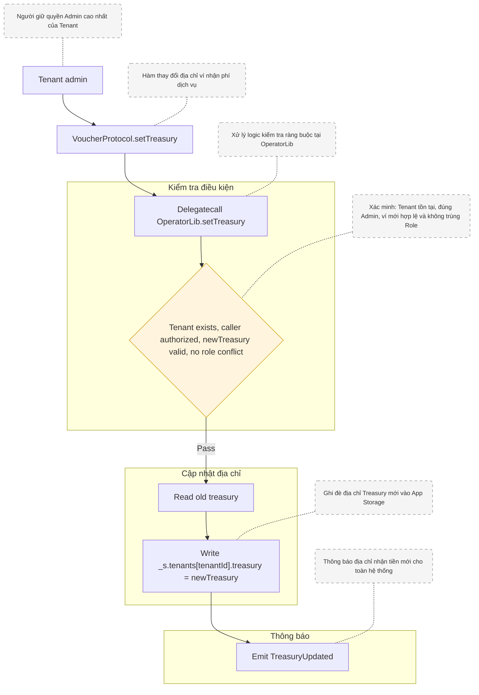
```mermaid
flowchart TD
    %% Định nghĩa các bước chính
    A[Tenant admin] --> B[VoucherProtocol.setTreasury]
    B --> C[Delegatecall OperatorLib.setTreasury]

    subgraph Validation [Kiểm tra điều kiện]
        C --> D{Tenant exists, caller authorized, newTreasury valid, no role conflict}
    end

    subgraph State_Update [Cập nhật địa chỉ]
        D -->|Pass| E[Read old treasury]
        E --> F["Write _s.tenants[tenantId].treasury = newTreasury"]
    end

    subgraph Finalize [Thông báo]
        F --> G[Emit TreasuryUpdated]
    end

    %% Ghi chú chi tiết bằng nét đứt
    N1("Người giữ quyền Admin cao nhất của Tenant") -.- A
    N2("Hàm thay đổi địa chỉ ví nhận phí dịch vụ") -.- B
    N3("Xử lý logic kiểm tra ràng buộc tại OperatorLib") -.- C
    N4("Xác minh: Tenant tồn tại, đúng Admin, ví mới hợp lệ và không trùng Role") -.- D
    N5("Ghi đè địa chỉ Treasury mới vào App Storage") -.- F
    N6("Thông báo địa chỉ nhận tiền mới cho toàn hệ thống") -.- G

    %% Style cho các ghi chú
    classDef note fill:#f5f5f5,stroke:#999,stroke-dasharray: 5 5,font-size:12px;
    class N1,N2,N3,N4,N5,N6 note

    %% Style cho logic
    style D fill:#fff4dd,stroke:#d4a017
```

> Quản trị viên tenant thay đổi địa chỉ ví kho tiền — nơi nhận các khoản tiền phạt từ operator vi phạm. Thao tác này đòi hỏi kiểm tra nghiêm ngặt để đảm bảo ví mới không xung đột với các vai trò quản trị khác trong tenant.

### `slashOperator`

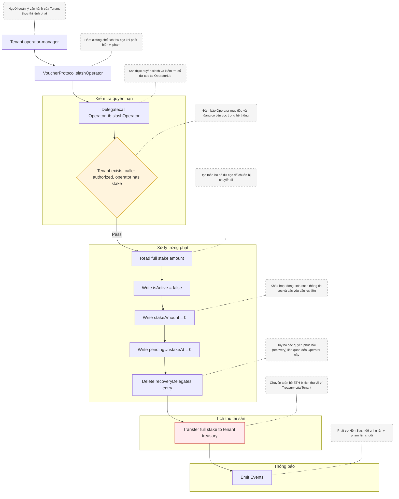
```mermaid
flowchart TD
    %% Định nghĩa các bước chính
    A[Tenant operator-manager] --> B[VoucherProtocol.slashOperator]
    B --> C[Delegatecall OperatorLib.slashOperator]

    subgraph Validation [Kiểm tra quyền hạn]
        C --> D{Tenant exists, caller authorized, operator has stake}
    end

    subgraph Punishment_Logic [Xử lý trừng phạt]
        D -->|Pass| E[Read full stake amount]
        E --> F[Write isActive = false]
        F --> G[Write stakeAmount = 0]
        G --> H[Write pendingUnstakeAt = 0]
        H --> I[Delete recoveryDelegates entry]
    end

    subgraph Asset_Seizure [Tịch thu tài sản]
        I --> J[Transfer full stake to tenant treasury]
    end

    subgraph Finalize [Thông báo]
        J --> K[Emit Events]
    end

    %% Ghi chú chi tiết bằng nét đứt
    N1("Người quản lý vận hành của Tenant thực thi lệnh phạt") -.- A
    N2("Hàm cưỡng chế tịch thu cọc khi phát hiện vi phạm") -.- B
    N3("Xác thực quyền slash và kiểm tra số dư cọc tại OperatorLib") -.- C
    N4("Đảm bảo Operator mục tiêu vẫn đang có tiền cọc trong hệ thống") -.- D
    N5("Đọc toàn bộ số dư cọc để chuẩn bị chuyển đi") -.- E
    N6("Khóa hoạt động, xóa sạch thông tin cọc và các yêu cầu rút tiền") -.- G
    N7("Hủy bỏ các quyền phục hồi (recovery) liên quan đến Operator này") -.- I
    N8("Chuyển toàn bộ ETH bị tịch thu về ví Treasury của Tenant") -.- J
    N9("Phát sự kiện Slash để ghi nhận vi phạm lên chuỗi") -.- K

    %% Style cho các ghi chú
    classDef note fill:#f5f5f5,stroke:#999,stroke-dasharray: 5 5,font-size:12px;
    class N1,N2,N3,N4,N5,N6,N7,N8,N9 note

    %% Style cho logic
    style D fill:#fff4dd,stroke:#d4a017
    style J fill:#ffebee,stroke:#c62828
```

> Người quản lý vận hành xử phạt nặng một operator vi phạm nghiêm trọng: toàn bộ tiền cọc bị tịch thu và chuyển vào kho tiền của tenant, operator bị vô hiệu hóa hoàn toàn và mất mọi quyền vận hành ngay lập tức.

### `softSlashOperator`

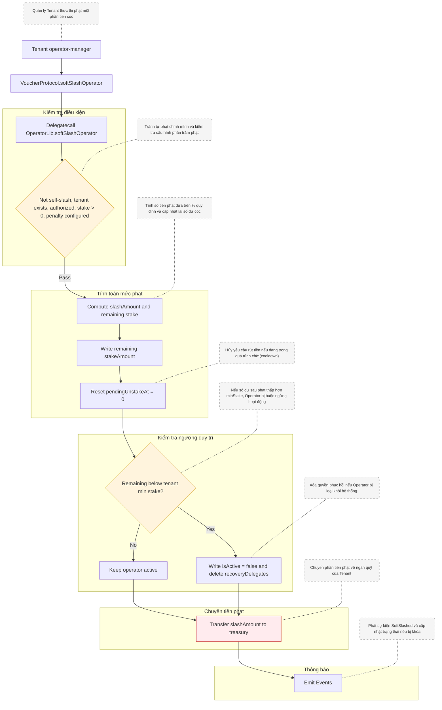
```mermaid
flowchart TD
    %% Định nghĩa các bước chính
    A[Tenant operator-manager] --> B[VoucherProtocol.softSlashOperator]
    B --> C[Delegatecall OperatorLib.softSlashOperator]

    subgraph Validation [Kiểm tra điều kiện]
        C --> D{Not self-slash, tenant exists, authorized, stake > 0, penalty configured}
    end

    subgraph Slash_Calculation [Tính toán mức phạt]
        D -->|Pass| E[Compute slashAmount and remaining stake]
        E --> F[Write remaining stakeAmount]
        F --> G[Reset pendingUnstakeAt = 0]
    end

    subgraph Status_Check [Kiểm tra ngưỡng duy trì]
        G --> H{Remaining below tenant min stake?}
        H -->|Yes| I[Write isActive = false and delete recoveryDelegates]
        H -->|No| J[Keep operator active]
    end

    subgraph Asset_Transfer [Chuyển tiền phạt]
        I --> K[Transfer slashAmount to treasury]
        J --> K
    end

    subgraph Finalize [Thông báo]
        K --> L[Emit Events]
    end

    %% Ghi chú chi tiết bằng nét đứt
    N1("Quản lý Tenant thực thi phạt một phần tiền cọc") -.- A
    N2("Tránh tự phạt chính mình và kiểm tra cấu hình phần trăm phạt") -.- D
    N3("Tính số tiền phạt dựa trên % quy định và cập nhật lại số dư cọc") -.- E
    N4("Hủy yêu cầu rút tiền nếu đang trong quá trình chờ (cooldown)") -.- G
    N5("Nếu số dư sau phạt thấp hơn minStake, Operator bị buộc ngừng hoạt động") -.- H
    N6("Xóa quyền phục hồi nếu Operator bị loại khỏi hệ thống") -.- I
    N7("Chuyển phần tiền phạt về ngân quỹ của Tenant") -.- K
    N8("Phát sự kiện SoftSlashed và cập nhật trạng thái nếu bị khóa") -.- L

    %% Style cho các ghi chú
    classDef note fill:#f5f5f5,stroke:#999,stroke-dasharray: 5 5,font-size:12px;
    class N1,N2,N3,N4,N5,N6,N7,N8 note

    %% Style cho logic
    style D fill:#fff4dd,stroke:#d4a017
    style H fill:#fff4dd,stroke:#d4a017
    style K fill:#ffebee,stroke:#c62828
```

> Người quản lý vận hành áp dụng hình phạt có mức độ dựa trên loại vi phạm — chỉ trừ một phần tiền cọc thay vì tịch thu toàn bộ. Nếu sau khi phạt mà tiền cọc còn lại thấp hơn ngưỡng tối thiểu, operator sẽ bị đình chỉ tự động.

### `setMinOperatorStake`

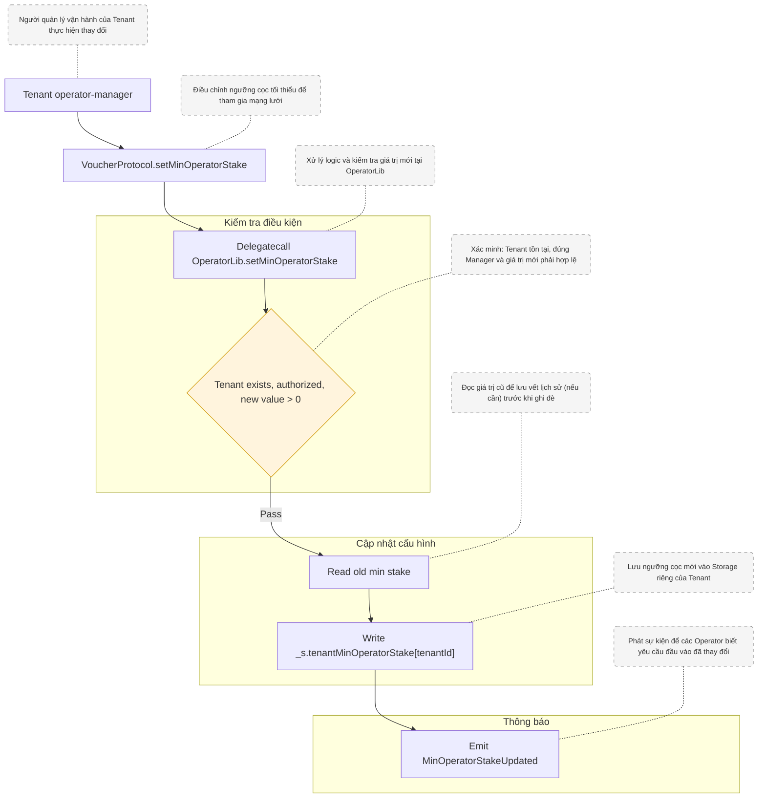
```mermaid
flowchart TD
    %% Định nghĩa các bước chính
    A[Tenant operator-manager] --> B[VoucherProtocol.setMinOperatorStake]
    B --> C[Delegatecall OperatorLib.setMinOperatorStake]

    subgraph Validation [Kiểm tra điều kiện]
        C --> D{Tenant exists, authorized, new value > 0}
    end

    subgraph State_Update [Cập nhật cấu hình]
        D -->|Pass| E[Read old min stake]
        E --> F["Write _s.tenantMinOperatorStake[tenantId]"]
    end

    subgraph Finalize [Thông báo]
        F --> G[Emit MinOperatorStakeUpdated]
    end

    %% Ghi chú chi tiết bằng nét đứt
    N1("Người quản lý vận hành của Tenant thực hiện thay đổi") -.- A
    N2("Điều chỉnh ngưỡng cọc tối thiểu để tham gia mạng lưới") -.- B
    N3("Xử lý logic và kiểm tra giá trị mới tại OperatorLib") -.- C
    N4("Xác minh: Tenant tồn tại, đúng Manager và giá trị mới phải hợp lệ") -.- D
    N5("Đọc giá trị cũ để lưu vết lịch sử (nếu cần) trước khi ghi đè") -.- E
    N6("Lưu ngưỡng cọc mới vào Storage riêng của Tenant") -.- F
    N7("Phát sự kiện để các Operator biết yêu cầu đầu vào đã thay đổi") -.- G

    %% Style cho các ghi chú
    classDef note fill:#f5f5f5,stroke:#999,stroke-dasharray: 5 5,font-size:12px;
    class N1,N2,N3,N4,N5,N6,N7 note

    %% Style cho logic
    style D fill:#fff4dd,stroke:#d4a017
```

> Người quản lý vận hành điều chỉnh mức tiền cọc tối thiểu mà một operator phải duy trì để được hoạt động trong tenant. Đây là tham số quản lý rủi ro, có thể được nâng lên khi tenant cần tăng chuẩn vận hành.

### `setUnstakeCooldown`

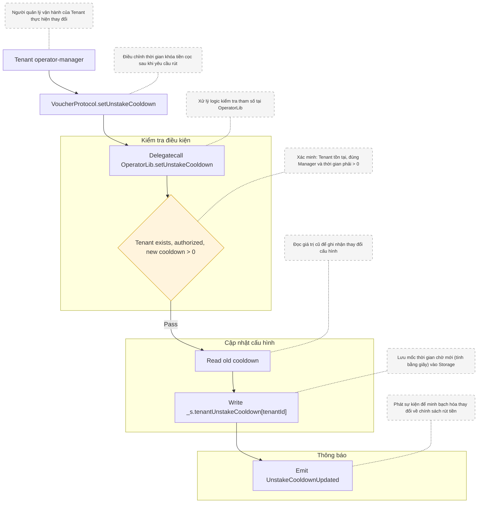
```mermaid
flowchart TD
    %% Định nghĩa các bước chính
    A[Tenant operator-manager] --> B[VoucherProtocol.setUnstakeCooldown]
    B --> C[Delegatecall OperatorLib.setUnstakeCooldown]

    subgraph Validation [Kiểm tra điều kiện]
        C --> D{Tenant exists, authorized, new cooldown > 0}
    end

    subgraph State_Update [Cập nhật cấu hình]
        D -->|Pass| E[Read old cooldown]
        E --> F["Write _s.tenantUnstakeCooldown[tenantId]"]
    end

    subgraph Finalize [Thông báo]
        F --> G[Emit UnstakeCooldownUpdated]
    end

    %% Ghi chú chi tiết bằng nét đứt
    N1("Người quản lý vận hành của Tenant thực hiện thay đổi") -.- A
    N2("Điều chỉnh thời gian khóa tiền cọc sau khi yêu cầu rút") -.- B
    N3("Xử lý logic kiểm tra tham số tại OperatorLib") -.- C
    N4("Xác minh: Tenant tồn tại, đúng Manager và thời gian phải > 0") -.- D
    N5("Đọc giá trị cũ để ghi nhận thay đổi cấu hình") -.- E
    N6("Lưu mốc thời gian chờ mới (tính bằng giây) vào Storage") -.- F
    N7("Phát sự kiện để minh bạch hóa thay đổi về chính sách rút tiền") -.- G

    %% Style cho các ghi chú
    classDef note fill:#f5f5f5,stroke:#999,stroke-dasharray: 5 5,font-size:12px;
    class N1,N2,N3,N4,N5,N6,N7 note

    %% Style cho logic
    style D fill:#fff4dd,stroke:#d4a017
```

> Người quản lý vận hành cấu hình thời gian chờ bắt buộc giữa lúc operator yêu cầu rút cọc và lúc thực sự được rút. Khoảng thời gian này giúp hệ thống có đủ thời gian xử lý các giao dịch còn dang dở trước khi operator rời đi.

### `setViolationPenalty`

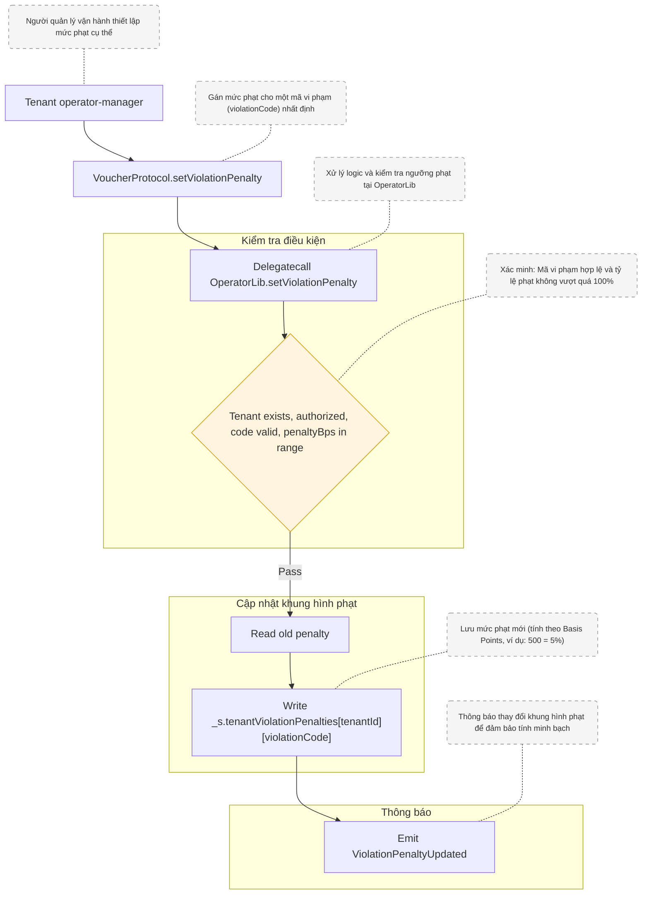
```mermaid
flowchart TD
    %% Định nghĩa các bước chính
    A[Tenant operator-manager] --> B[VoucherProtocol.setViolationPenalty]
    B --> C[Delegatecall OperatorLib.setViolationPenalty]

    subgraph Validation [Kiểm tra điều kiện]
        C --> D{Tenant exists, authorized, code valid, penaltyBps in range}
    end

    subgraph State_Update [Cập nhật khung hình phạt]
        D -->|Pass| E[Read old penalty]
        E --> F["Write _s.tenantViolationPenalties[tenantId][violationCode]"]
    end

    subgraph Finalize [Thông báo]
        F --> G[Emit ViolationPenaltyUpdated]
    end

    %% Ghi chú chi tiết bằng nét đứt
    N1("Người quản lý vận hành thiết lập mức phạt cụ thể") -.- A
    N2("Gán mức phạt cho một mã vi phạm (violationCode) nhất định") -.- B
    N3("Xử lý logic và kiểm tra ngưỡng phạt tại OperatorLib") -.- C
    N4("Xác minh: Mã vi phạm hợp lệ và tỷ lệ phạt không vượt quá 100%") -.- D
    N5("Lưu mức phạt mới (tính theo Basis Points, ví dụ: 500 = 5%)") -.- F
    N6("Thông báo thay đổi khung hình phạt để đảm bảo tính minh bạch") -.- G

    %% Style cho các ghi chú
    classDef note fill:#f5f5f5,stroke:#999,stroke-dasharray: 5 5,font-size:12px;
    class N1,N2,N3,N4,N5,N6 note

    %% Style cho logic
    style D fill:#fff4dd,stroke:#d4a017
```

> Người quản lý vận hành thiết lập mức phạt (tính theo phần trăm của tiền cọc) tương ứng với từng loại vi phạm. Đây là bước cấu hình bảng xử phạt nội bộ của tenant trước khi sử dụng tính năng soft slash.

## 3. Document Anchoring

### `registerWithSignature`

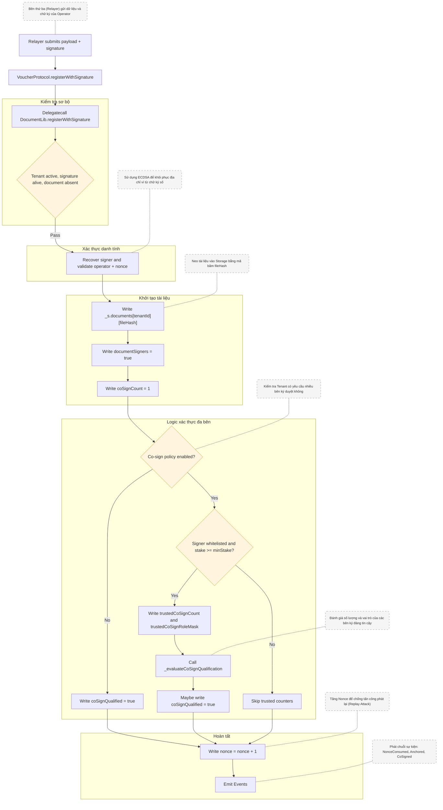
```mermaid
flowchart TD
    %% Định nghĩa các bước chính
    A[Relayer submits payload + signature] --> B[VoucherProtocol.registerWithSignature]
    B --> C[Delegatecall DocumentLib.registerWithSignature]

    subgraph Validation [Kiểm tra sơ bộ]
        C --> D{Tenant active, signature alive, document absent}
    end

    subgraph Signer_Recovery [Xác thực danh tính]
        D -->|Pass| E[Recover signer and validate operator + nonce]
    end

    subgraph Storage_Init [Khởi tạo tài liệu]
        E --> F["Write _s.documents[tenantId][fileHash]"]
        F --> G[Write documentSigners = true]
        G --> H[Write coSignCount = 1]
    end

    subgraph CoSign_Logic [Logic xác thực đa bên]
        H --> I{Co-sign policy enabled?}
        I -->|No| J[Write coSignQualified = true]
        I -->|Yes| K{Signer whitelisted and stake >= minStake?}
        K -->|Yes| L[Write trustedCoSignCount and trustedCoSignRoleMask]
        L --> M[Call _evaluateCoSignQualification]
        M --> N[Maybe write coSignQualified = true]
        K -->|No| O[Skip trusted counters]
    end

    subgraph Finalize [Hoàn tất]
        J --> P[Write nonce = nonce + 1]
        N --> P
        O --> P
        P --> Q[Emit Events]
    end

    %% Ghi chú chi tiết
    N1("Bên thứ ba (Relayer) gửi dữ liệu và chữ ký của Operator") -.- A
    N2("Sử dụng ECDSA để khôi phục địa chỉ ví từ chữ ký số") -.- E
    N3("Neo tài liệu vào Storage bằng mã băm fileHash") -.- F
    N4("Kiểm tra Tenant có yêu cầu nhiều bên ký duyệt không") -.- I
    N5("Đánh giá số lượng và vai trò của các bên ký đáng tin cậy") -.- M
    N6("Tăng Nonce để chống tấn công phát lại (Replay Attack)") -.- P
    N7("Phát chuỗi sự kiện: NonceConsumed, Anchored, CoSigned") -.- Q

    %% Style cho các ghi chú
    classDef note fill:#f5f5f5,stroke:#999,stroke-dasharray: 5 5,font-size:12px;
    class N1,N2,N3,N4,N5,N6,N7 note

    %% Style cho logic
    style D fill:#fff4dd,stroke:#d4a017
    style I fill:#fff4dd,stroke:#d4a017
    style K fill:#fff4dd,stroke:#d4a017
```

> Một tài liệu (voucher, hợp đồng, chứng từ...) được đăng ký lên blockchain thông qua chữ ký số của operator. Hệ thống ghi nhận toàn bộ thông tin định danh tài liệu — bao gồm mã băm, người phát hành, thời gian và loại tài liệu — như một bằng chứng không thể chỉnh sửa về sự tồn tại và tính hợp lệ của tài liệu tại thời điểm đó.

### `revokeDocument`

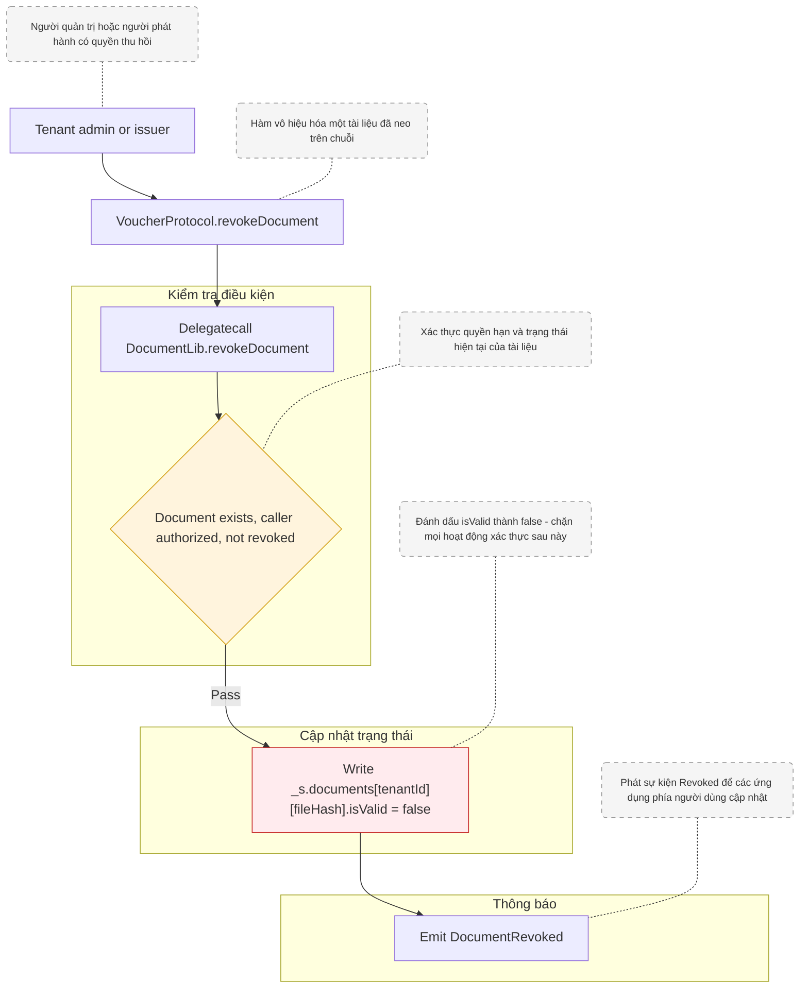
```mermaid
flowchart TD
    %% Định nghĩa các bước chính
    A[Tenant admin or issuer] --> B[VoucherProtocol.revokeDocument]
    B --> C[Delegatecall DocumentLib.revokeDocument]

    subgraph Validation [Kiểm tra điều kiện]
        C --> D{Document exists, caller authorized, not revoked}
    end

    subgraph State_Update [Cập nhật trạng thái]
        D -->|Pass| E["Write _s.documents[tenantId][fileHash].isValid = false"]
    end

    subgraph Finalize [Thông báo]
        E --> F[Emit DocumentRevoked]
    end

    %% Ghi chú chi tiết bằng nét đứt
    N1("Người quản trị hoặc người phát hành có quyền thu hồi") -.- A
    N2("Hàm vô hiệu hóa một tài liệu đã neo trên chuỗi") -.- B
    N3("Xác thực quyền hạn và trạng thái hiện tại của tài liệu") -.- D
    N4("Đánh dấu isValid thành false - chặn mọi hoạt động xác thực sau này") -.- E
    N5("Phát sự kiện Revoked để các ứng dụng phía người dùng cập nhật") -.- F

    %% Style cho các ghi chú
    classDef note fill:#f5f5f5,stroke:#999,stroke-dasharray: 5 5,font-size:12px;
    class N1,N2,N3,N4,N5 note

    %% Style cho logic
    style D fill:#fff4dd,stroke:#d4a017
    style E fill:#ffebee,stroke:#c62828
```

> Quản trị viên tenant hoặc chính operator phát hành có thể thu hồi một tài liệu đã đăng ký khi tài liệu không còn hiệu lực. Tài liệu bị đánh dấu vô hiệu nhưng vẫn được lưu lại trên chuỗi như hồ sơ lịch sử.

## 4. Co-Sign Governance Và Ký Bổ Sung

### `coSignDocumentWithSignature`

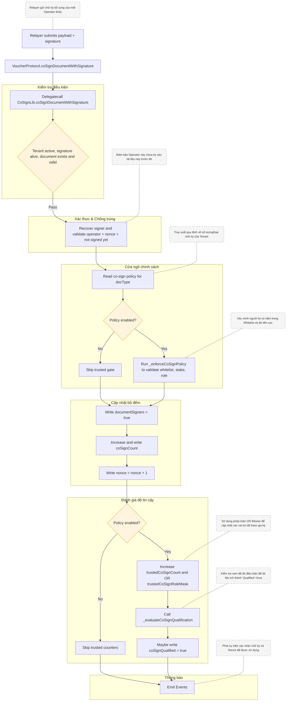
```mermaid
flowchart TD
    %% Định nghĩa các bước chính
    A[Relayer submits payload + signature] --> B[VoucherProtocol.coSignDocumentWithSignature]
    B --> C[Delegatecall CoSignLib.coSignDocumentWithSignature]

    subgraph Validation [Kiểm tra điều kiện]
        C --> D{Tenant active, signature alive, document exists and valid}
    end

    subgraph Signer_Check [Xác thực & Chống trùng]
        D -->|Pass| E[Recover signer and validate operator + nonce + not signed yet]
    end

    subgraph Policy_Gate [Cửa ngõ chính sách]
        E --> F[Read co-sign policy for docType]
        F --> G{Policy enabled?}
        G -->|Yes| H[Run _enforceCoSignPolicy to validate whitelist, stake, role]
        G -->|No| I[Skip trusted gate]
    end

    subgraph Counter_Update [Cập nhật bộ đếm]
        H --> J[Write documentSigners = true]
        I --> J
        J --> K[Increase and write coSignCount]
        K --> L[Write nonce = nonce + 1]
    end

    subgraph Trust_Evaluation [Đánh giá độ tin cậy]
        L --> M{Policy enabled?}
        M -->|Yes| N[Increase trustedCoSignCount and OR trustedCoSignRoleMask]
        N --> O[Call _evaluateCoSignQualification]
        O --> P[Maybe write coSignQualified = true]
        M -->|No| Q[Skip trusted counters]
    end

    subgraph Finalize [Thông báo]
        P --> R[Emit Events]
        Q --> R
    end

    %% Ghi chú chi tiết bằng nét đứt
    N1("Relayer gửi chữ ký bổ sung của một Operator khác") -.- A
    N2("Đảm bảo Operator này chưa ký vào tài liệu này trước đó") -.- E
    N3("Truy xuất quy định về số lượng/loại chữ ký của Tenant") -.- F
    N4("Xác minh người ký có nằm trong Whitelist và đủ tiền cọc") -.- H
    N5("Sử dụng phép toán OR Bitwise để cập nhật các vai trò đã tham gia ký") -.- N
    N6("Kiểm tra xem đã đủ điều kiện để tài liệu trở thành 'Qualified' chưa") -.- O
    N7("Phát sự kiện xác nhận chữ ký và Nonce đã được sử dụng") -.- R

    %% Style cho các ghi chú
    classDef note fill:#f5f5f5,stroke:#999,stroke-dasharray: 5 5,font-size:12px;
    class N1,N2,N3,N4,N5,N6,N7 note

    %% Style cho logic
    style D fill:#fff4dd,stroke:#d4a017
    style G fill:#fff4dd,stroke:#d4a017
    style M fill:#fff4dd,stroke:#d4a017
```

> Một operator khác (ngoài người đăng ký ban đầu) ký xác nhận bổ sung cho một tài liệu đã tồn tại. Đây là cơ chế "đa chữ ký" — hệ thống theo dõi số lượng và vai trò của các bên đã ký, và tự động đánh dấu tài liệu là "đủ điều kiện" khi đạt ngưỡng quy định trong policy.

### `setCoSignPolicy`

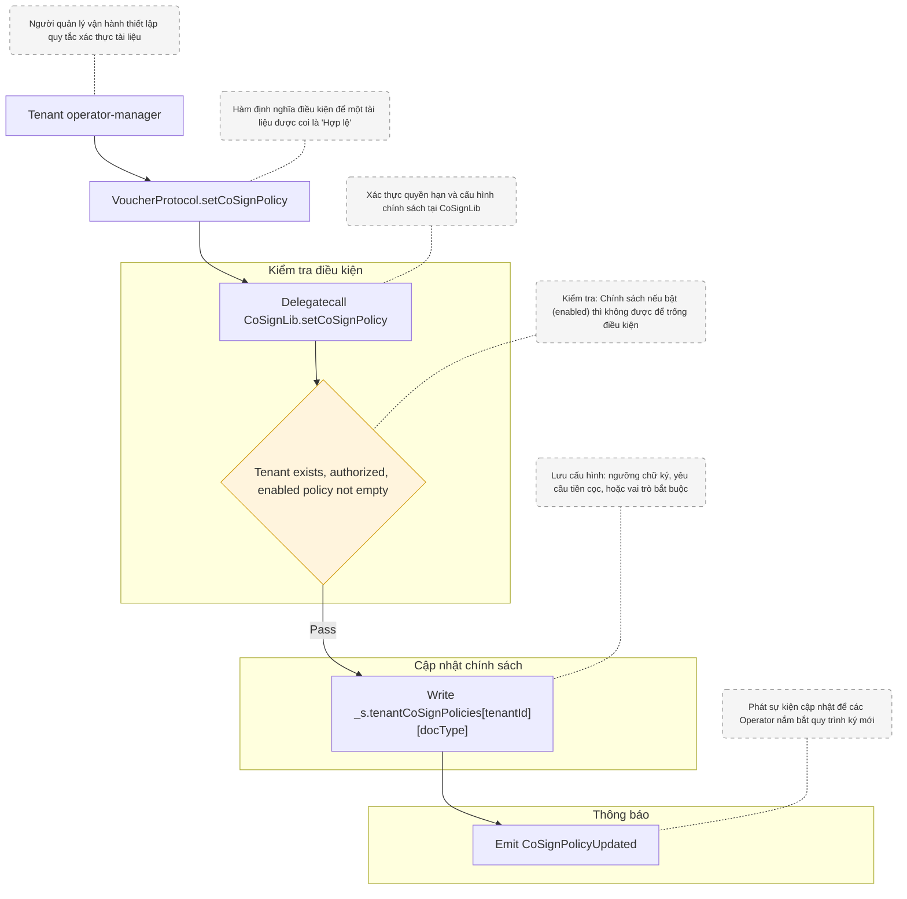
```mermaid
flowchart TD
    %% Định nghĩa các bước chính
    A[Tenant operator-manager] --> B[VoucherProtocol.setCoSignPolicy]
    B --> C[Delegatecall CoSignLib.setCoSignPolicy]

    subgraph Validation [Kiểm tra điều kiện]
        C --> D{Tenant exists, authorized, enabled policy not empty}
    end

    subgraph State_Update [Cập nhật chính sách]
        D -->|Pass| E["Write _s.tenantCoSignPolicies[tenantId][docType]"]
    end

    subgraph Finalize [Thông báo]
        E --> F[Emit CoSignPolicyUpdated]
    end

    %% Ghi chú chi tiết bằng nét đứt
    N1("Người quản lý vận hành thiết lập quy tắc xác thực tài liệu") -.- A
    N2("Hàm định nghĩa điều kiện để một tài liệu được coi là 'Hợp lệ'") -.- B
    N3("Xác thực quyền hạn và cấu hình chính sách tại CoSignLib") -.- C
    N4("Kiểm tra: Chính sách nếu bật (enabled) thì không được để trống điều kiện") -.- D
    N5("Lưu cấu hình: ngưỡng chữ ký, yêu cầu tiền cọc, hoặc vai trò bắt buộc") -.- E
    N6("Phát sự kiện cập nhật để các Operator nắm bắt quy trình ký mới") -.- F

    %% Style cho các ghi chú
    classDef note fill:#f5f5f5,stroke:#999,stroke-dasharray: 5 5,font-size:12px;
    class N1,N2,N3,N4,N5,N6 note

    %% Style cho logic
    style D fill:#fff4dd,stroke:#d4a017
```

> Người quản lý vận hành thiết lập quy tắc xác nhận đa chữ ký cho một loại tài liệu cụ thể: cần bao nhiêu chữ ký, từ những vai trò nào. Đây là bước cấu hình quy trình phê duyệt nội bộ trước khi áp dụng cho hoạt động thực tế.

### `setCoSignOperator`

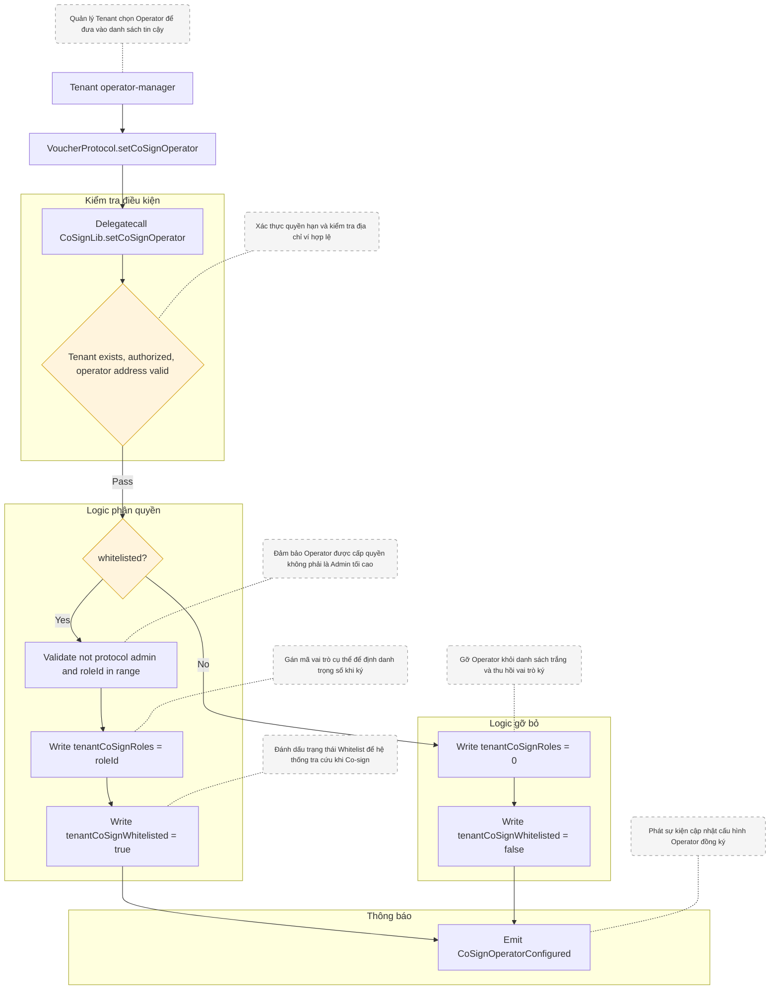
```mermaid
flowchart TD
    %% Định nghĩa các bước chính
    A[Tenant operator-manager] --> B[VoucherProtocol.setCoSignOperator]
    B --> C[Delegatecall CoSignLib.setCoSignOperator]

    subgraph Validation [Kiểm tra điều kiện]
        C --> D{Tenant exists, authorized, operator address valid}
    end

    subgraph Whitelist_Logic [Logic phân quyền]
        D -->|Pass| E{whitelisted?}
        E -->|Yes| F[Validate not protocol admin and roleId in range]
        F --> G[Write tenantCoSignRoles = roleId]
        G --> I[Write tenantCoSignWhitelisted = true]
    end

    subgraph Blacklist_Logic [Logic gỡ bỏ]
        E -->|No| H[Write tenantCoSignRoles = 0]
        H --> J[Write tenantCoSignWhitelisted = false]
    end

    subgraph Finalize [Thông báo]
        I --> K[Emit CoSignOperatorConfigured]
        J --> K
    end

    %% Ghi chú chi tiết bằng nét đứt
    N1("Quản lý Tenant chọn Operator để đưa vào danh sách tin cậy") -.- A
    N2("Xác thực quyền hạn và kiểm tra địa chỉ ví hợp lệ") -.- D
    N3("Đảm bảo Operator được cấp quyền không phải là Admin tối cao") -.- F
    N4("Gán mã vai trò cụ thể để định danh trọng số khi ký") -.- G
    N5("Gỡ Operator khỏi danh sách trắng và thu hồi vai trò ký") -.- H
    N6("Đánh dấu trạng thái Whitelist để hệ thống tra cứu khi Co-sign") -.- I
    N7("Phát sự kiện cập nhật cấu hình Operator đồng ký") -.- K

    %% Style cho các ghi chú
    classDef note fill:#f5f5f5,stroke:#999,stroke-dasharray: 5 5,font-size:12px;
    class N1,N2,N3,N4,N5,N6,N7 note

    %% Style cho logic
    style D fill:#fff4dd,stroke:#d4a017
    style E fill:#fff4dd,stroke:#d4a017
```

> Người quản lý vận hành thêm hoặc xóa một operator khỏi danh sách được phép ký xác nhận cho một loại tài liệu nhất định, đồng thời chỉ định vai trò của operator đó trong quy trình co-sign. Đây là quản lý danh sách "người ký được ủy quyền" cho từng loại chứng từ.

## 5. Recovery

### `setRecoveryDelegate`

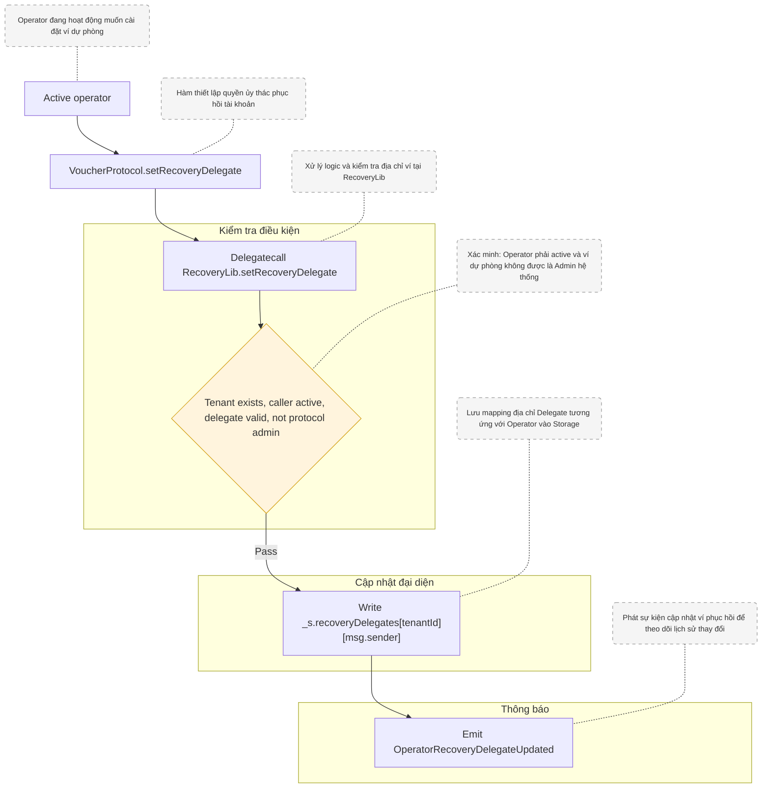
```mermaid
flowchart TD
    %% Định nghĩa các bước chính
    A[Active operator] --> B[VoucherProtocol.setRecoveryDelegate]
    B --> C[Delegatecall RecoveryLib.setRecoveryDelegate]

    subgraph Validation [Kiểm tra điều kiện]
        C --> D{Tenant exists, caller active, delegate valid, not protocol admin}
    end

    subgraph State_Update [Cập nhật đại diện]
        D -->|Pass| E["Write _s.recoveryDelegates[tenantId][msg.sender]"]
    end

    subgraph Finalize [Thông báo]
        E --> F[Emit OperatorRecoveryDelegateUpdated]
    end

    %% Ghi chú chi tiết bằng nét đứt
    N1("Operator đang hoạt động muốn cài đặt ví dự phòng") -.- A
    N2("Hàm thiết lập quyền ủy thác phục hồi tài khoản") -.- B
    N3("Xử lý logic và kiểm tra địa chỉ ví tại RecoveryLib") -.- C
    N4("Xác minh: Operator phải active và ví dự phòng không được là Admin hệ thống") -.- D
    N5("Lưu mapping địa chỉ Delegate tương ứng với Operator vào Storage") -.- E
    N6("Phát sự kiện cập nhật ví phục hồi để theo dõi lịch sử thay đổi") -.- F

    %% Style cho các ghi chú
    classDef note fill:#f5f5f5,stroke:#999,stroke-dasharray: 5 5,font-size:12px;
    class N1,N2,N3,N4,N5,N6 note

    %% Style cho logic
    style D fill:#fff4dd,stroke:#d4a017
```

> Operator chỉ định trước một địa chỉ ví tin cậy (delegate) có quyền khôi phục tài khoản hộ mình trong trường hợp mất quyền truy cập ví. Đây là biện pháp dự phòng, tương tự như đăng ký người thừa kế hoặc liên lạc khẩn cấp.

### `recoverOperatorByDelegate`

```mermaid
flowchart TD
    %% Định nghĩa các bước chính
    A[Registered delegate caller] --> B[VoucherProtocol.recoverOperatorByDelegate]
    B --> C[Delegatecall RecoveryLib.recoverOperatorByDelegate]

    subgraph Validation [Xác thực quyền phục hồi]
        C --> D{Tenant exists, delegate authorized, lost operator has stake, no pending unstake, caller is clean target}
    end

    subgraph Data_Migration [Di chuyển dữ liệu]
        D -->|Pass| E[Read old operator data]
        E --> F["Write _s.operators[tenantId][msg.sender] from oldData"]
        F --> G{New wallet already listed?}
        G -->|No| H[Push into operatorList and set isOperatorListed]
        G -->|Yes| I[Skip list update]
        H --> J[Copy nonce and reset pendingUnstakeAt]
        I --> J
    end

    subgraph Cleanup_Legacy [Dọn dẹp & Liên kết]
        J --> K[Call _linkRecoveryAlias]
        K --> L[Write recoveredFrom and recoveredTo]
        L --> M[Delete old operator, old nonce, old pendingUnstakeAt, old recoveryDelegate]
    end

    subgraph Finalize [Thông báo]
        M --> N[Emit Events]
    end

    %% Ghi chú chi tiết bằng nét đứt
    N1("Ví Delegate thực hiện lệnh cứu hộ cho ví Operator đã mất") -.- A
    N2("Kiểm tra ví mới phải 'sạch' và ví cũ phải đang có tiền cọc") -.- D
    N3("Chuyển toàn bộ thông tin cọc và trạng thái sang ví mới") -.- F
    N4("Sao chép Nonce để đảm bảo tính liên tục của các chữ ký số") -.- J
    N5("Thiết lập bí danh (Alias) để truy vết lịch sử phục hồi") -.- K
    N6("Hủy toàn bộ dữ liệu tại ví cũ để tránh bị lợi dụng") -.- M
    N7("Phát sự kiện Recovered và cập nhật thông tin Delegate mới") -.- N

    %% Style cho các ghi chú
    classDef note fill:#f5f5f5,stroke:#999,stroke-dasharray: 5 5,font-size:12px;
    class N1,N2,N3,N4,N5,N6,N7 note

    %% Style cho logic
    style D fill:#fff4dd,stroke:#d4a017
    style M fill:#ffebee,stroke:#c62828
```

> Khi một operator mất quyền truy cập ví cũ, delegate đã đăng ký trước đó có thể thực hiện chuyển toàn bộ hồ sơ vận hành — bao gồm tiền cọc, lịch sử nonce — sang ví mới. Ví cũ bị xóa khỏi hệ thống, ví mới tiếp tục hoạt động liên tục mà không cần nộp cọc lại.

### `recoverOperatorByAdmin`

```mermaid
flowchart TD
    %% Định nghĩa các bước chính
    A[Tenant operator-manager] --> B[VoucherProtocol.recoverOperatorByAdmin]
    B --> C[Delegatecall RecoveryLib.recoverOperatorByAdmin]

    subgraph Validation [Xác thực quyền quản trị]
        C --> D{Tenant exists, caller authorized, lost operator invalidated, newOperator valid and clean}
    end

    subgraph Data_Migration [Di chuyển dữ liệu cưỡng chế]
        D -->|Pass| E[Read old operator data]
        E --> F["Write _s.operators[tenantId][newOperator] from oldData"]
        F --> G{New wallet already listed?}
        G -->|No| H[Push into operatorList and set isOperatorListed]
        G -->|Yes| I[Skip list update]
        H --> J[Copy nonce and reset pendingUnstakeAt]
        I --> J
    end

    subgraph Cleanup_Legacy [Dọn dẹp & Liên kết]
        J --> K[Call _linkRecoveryAlias]
        K --> L[Write recoveredFrom and recoveredTo]
        L --> M[Delete old operator, old nonce, old pendingUnstakeAt, old recoveryDelegate]
    end

    subgraph Finalize [Thông báo]
        M --> N[Emit Events]
    end

    %% Ghi chú chi tiết bằng nét đứt
    N1("Quản trị viên Tenant thực hiện phục hồi cưỡng chế") -.- A
    N2("Xác minh Operator cũ đã bị vô hiệu hóa (invalidated) trước khi cứu hộ") -.- D
    N3("Sao chép toàn bộ thông tin cọc và Nonce sang ví đích mới") -.- F
    N4("Đảm bảo ví mới không trùng lặp trong danh sách vận hành") -.- G
    N5("Ghi nhận vết tích phục hồi (Audit Trail) giữa hai địa chỉ ví") -.- L
    N6("Giải phóng Storage tại địa chỉ ví cũ để tối ưu hóa dữ liệu") -.- M
    N7("Phát sự kiện Recovered để hệ thống giám sát ghi nhận thay đổi") -.- N

    %% Style cho các ghi chú
    classDef note fill:#f5f5f5,stroke:#999,stroke-dasharray: 5 5,font-size:12px;
    class N1,N2,N3,N4,N5,N6,N7 note

    %% Style cho logic
    style D fill:#fff4dd,stroke:#d4a017
    style M fill:#ffebee,stroke:#c62828
```

> Trong trường hợp khẩn cấp hoặc khi không có delegate, người quản lý vận hành của tenant có thể cưỡng bức chuyển hồ sơ operator sang một địa chỉ ví mới được chỉ định. Đây là quyền can thiệp hành chính cao nhất trong quy trình recovery.

## 6. Role Management

### `grantRole`

```mermaid
flowchart TD
    %% Định nghĩa các bước chính
    A[Role admin caller] --> B[VoucherProtocol.grantRole]
    B --> C[Run _enforceTenantRoleSegregationOnGrant]

    subgraph Security_Check [Kiểm tra tách biệt quyền]
        C --> D{Tenant governance role and no admin/operatorManager/treasury conflict?}
    end

    subgraph Access_Control [Xử lý quyền hạn]
        D -->|Pass| E[Call OpenZeppelin _grantRole]
        E --> F[Write AccessControl role membership storage]
    end

    subgraph Finalize [Thông báo]
        F --> G[Emit RoleGranted if membership is new]
    end

    %% Ghi chú chi tiết bằng nét đứt
    N1("Người giữ quyền Admin quản lý vai trò") -.- A
    N2("Cơ chế kiểm tra chéo để tránh một ví giữ quá nhiều quyền nhạy cảm") -.- C
    N3("Ngăn chặn xung đột giữa Admin, Quản lý vận hành và Ví nhận tiền") -.- D
    N4("Sử dụng tiêu chuẩn AccessControl của OpenZeppelin để thực thi") -.- E
    N5("Ghi nhận quyền hạn mới vào Storage của hợp đồng") -.- F
    N6("Phát sự kiện chuẩn của ERC-5313/AccessControl") -.- G

    %% Style cho các ghi chú
    classDef note fill:#f5f5f5,stroke:#999,stroke-dasharray: 5 5,font-size:12px;
    class N1,N2,N3,N4,N5,N6 note

    %% Style cho logic
    style D fill:#fff4dd,stroke:#d4a017
```

> Người nắm quyền quản lý một vai trò cụ thể có thể trao vai trò đó cho một địa chỉ ví khác. Hệ thống tự động kiểm tra để ngăn chặn tình trạng xung đột quyền hạn — ví dụ một người không thể đồng thời giữ vai trò quản trị và vận hành trong cùng một tenant.

## 7. Helper Nội Bộ Có Ghi State

### `_registerTenantRole`

```mermaid
flowchart TD
    %% Định nghĩa các bước chính
    A[Called from createTenant] --> B[VoucherProtocolHelper._registerTenantRole]

    subgraph Mapping_Storage [Ánh xạ dữ liệu]
        B --> C["Write tenantRoleToTenantId[role] = tenantId"]
        C --> D["Write tenantRoleKinds[role] = roleKind"]
    end

    %% Ghi chú chi tiết bằng nét đứt
    N1("Được kích hoạt tự động trong quy trình thiết lập Tenant mới") -.- A
    N2("Hàm bổ trợ giúp quản lý danh mục vai trò theo Tenant") -.- B
    N3("Liên kết một Role cụ thể với ID của Tenant sở hữu") -.- C
    N4("Phân loại loại vai trò: ví dụ Admin, Operator Manager, hay Issuer") -.- D

    %% Style cho các ghi chú
    classDef note fill:#f5f5f5,stroke:#999,stroke-dasharray: 5 5,font-size:12px;
    class N1,N2,N3,N4 note

    %% Style cho logic
    style B fill:#e1f5fe,stroke:#01579b
```

> Được gọi tự động trong quá trình tạo tenant (createTenant). Hệ thống ghi nhận "vai trò này thuộc tenant nào và là loại vai trò gì" — giúp các bước kiểm tra quyền hạn sau này (như grantRole, setTreasury) có thể nhận diện và ngăn chặn xung đột quyền trong cùng một tenant. Người dùng không gọi trực tiếp bước này; nó xảy ra ngầm mỗi khi một tenant mới được khởi tạo.

### `_evaluateCoSignQualification` trong `DocumentLib`

```mermaid
flowchart TD
    %% Định nghĩa các bước chính
    A[Called from registerWithSignature or coSign] --> B[DocumentLib._evaluateCoSignQualification]

    subgraph State_Check [Kiểm tra trạng thái]
        B --> C{Already qualified?}
    end

    subgraph Evaluation [Đối soát chính sách]
        C -->|No| D[Read policy, trusted signer count, trusted role mask]
        D --> E{Meet minSigners and requiredRoleMask?}
    end

    subgraph Qualification [Cấp trạng thái Hợp lệ]
        E -->|Yes| F["Write _s.coSignQualified[tenantId][fileHash] = true"]
    end

    subgraph Finalize [Thông báo]
        F --> G[Emit DocumentCoSignQualified]
    end

    %% Ghi chú chi tiết bằng nét đứt
    N1("Được gọi tự động sau mỗi lượt ký (Issue hoặc Co-sign)") -.- A
    N2("Tránh tính toán lại nếu tài liệu đã đạt chuẩn từ trước") -.- C
    N3("Truy xuất dữ liệu: Ngưỡng chữ ký, số lượng tin cậy, và Bitmask vai trò") -.- D
    N4("Kiểm tra đồng thời: Đủ số người ký VÀ đủ các vai trò bắt buộc") -.- E
    N5("Đánh dấu tài liệu chính thức được công nhận bởi giao thức") -.- F
    N6("Thông báo cho hệ thống để phía Frontend hiển thị dấu tích xanh") -.- G

    %% Style cho các ghi chú
    classDef note fill:#f5f5f5,stroke:#999,stroke-dasharray: 5 5,font-size:12px;
    class N1,N2,N3,N4,N5,N6 note

    %% Style cho logic
    style C fill:#fff4dd,stroke:#d4a017
    style E fill:#fff4dd,stroke:#d4a017
```

> Được gọi tự động trong quá trình đăng ký tài liệu (registerWithSignature) khi policy co-sign đang bật. Ngay sau khi operator đầu tiên ký và đáp ứng đủ điều kiện trusted, helper này kiểm tra xem tài liệu đã đạt ngưỡng "đủ chữ ký hợp lệ" chưa — nếu có, hệ thống tự động đánh dấu tài liệu là qualified mà không cần thao tác thêm từ phía người dùng.

### `_evaluateCoSignQualification` trong `CoSignLib`

```mermaid
flowchart TD
    %% Định nghĩa các bước chính
    A[Called from coSignDocumentWithSignature] --> B[CoSignLib._evaluateCoSignQualification]

    subgraph State_Check [Kiểm tra trạng thái]
        B --> C{Already qualified?}
    end

    subgraph Evaluation [Đối soát chính sách]
        C -->|No| D[Read policy, trusted signer count, trusted role mask]
        D --> E{Meet minSigners and requiredRoleMask?}
    end

    subgraph Qualification [Cấp trạng thái Hợp lệ]
        E -->|Yes| F["Write _s.coSignQualified[tenantId][fileHash] = true"]
    end

    subgraph Finalize [Thông báo]
        F --> G[Emit DocumentCoSignQualified]
    end

    %% Ghi chú chi tiết bằng nét đứt
    N1("Kích hoạt ngay sau khi một chữ ký đồng thuận mới được ghi nhận") -.- A
    N2("Dừng xử lý nếu tài liệu đã đủ điều kiện từ các lượt ký trước") -.- C
    N3("Truy xuất quy định của Tenant cho loại tài liệu (docType) này") -.- D
    N4("Kiểm tra tổng số chữ ký tin cậy và sự hiện diện của các vai trò bắt buộc") -.- E
    N5("Xác nhận tài liệu chính thức đạt ngưỡng tin cậy cao nhất") -.- F
    N6("Phát sự kiện để các hệ thống Off-chain (Indexer) cập nhật trạng thái") -.- G

    %% Style cho các ghi chú
    classDef note fill:#f5f5f5,stroke:#999,stroke-dasharray: 5 5,font-size:12px;
    class N1,N2,N3,N4,N5,N6 note

    %% Style cho logic
    style C fill:#fff4dd,stroke:#d4a017
    style E fill:#fff4dd,stroke:#d4a017
```

> Được gọi tự động trong quá trình ký bổ sung (coSignDocumentWithSignature) mỗi khi một trusted operator hoàn tất chữ ký. Helper này liên tục kiểm tra sau mỗi lần ký xem tổng số chữ ký và tổ hợp vai trò đã đáp ứng đủ policy chưa — nếu đủ, tài liệu được tự động chuyển sang trạng thái qualified (đủ điều kiện hiệu lực).

### `_linkRecoveryAlias`

```mermaid
flowchart TD
    %% Định nghĩa các bước chính
    A[Called from recovery flow] --> B[RecoveryLib._linkRecoveryAlias]

    subgraph Root_Resolution [Xác định danh tính gốc]
        B --> C[Resolve rootOperator from recoveredFrom or oldOperator]
    end

    subgraph Linkage_Storage [Lưu trữ liên kết chuỗi]
        C --> D["Write _s.recoveredFrom[tenantId][newOperator] = rootOperator"]
        D --> E["Write _s.recoveredTo[tenantId][oldOperator] = newOperator"]
    end

    %% Ghi chú chi tiết bằng nét đứt
    N1("Kích hoạt trong quy trình cứu hộ ví (Admin hoặc Delegate gọi)") -.- A
    N2("Tìm ví đầu tiên (gốc) trong lịch sử phục hồi để giữ tính nhất quán") -.- C
    N3("Liên kết ví mới trực tiếp với ví gốc để tra cứu nhanh") -.- D
    N4("Đánh dấu ví cũ đã được chuyển sang ví mới nào") -.- E

    %% Style cho các ghi chú
    classDef note fill:#f5f5f5,stroke:#999,stroke-dasharray: 5 5,font-size:12px;
    class N1,N2,N3,N4 note

    %% Style cho logic
    style C fill:#e1f5fe,stroke:#01579b
```

> Được gọi tự động trong cả hai luồng recovery (recoverOperatorByDelegate và recoverOperatorByAdmin). Helper này duy trì "chuỗi lịch sử ví" của một operator — ghi nhận ví mới từ ví nào mà ra, và ví cũ đã được chuyển sang ví nào. Nhờ đó, hệ thống có thể truy vết toàn bộ quá trình thay ví của một operator qua nhiều lần recovery mà không bị đứt mạch lịch sử.

## 8. Constructor Ghi State Khi Deploy

### `constructor`

```mermaid
flowchart TD
    %% Định nghĩa các bước chính
    A[Deployer] --> B[VoucherProtocol.constructor]

    subgraph Governance_Setup [Thiết lập quản trị]
        B --> C[Write protocolOwner = msg.sender]
        C --> D[Call _grantRole for DEFAULT_ADMIN_ROLE]
        D --> E[Call _grantRole for PROTOCOL_ADMIN_ROLE]
    end

    subgraph Security_Config [Cấu hình bảo mật]
        E --> F[Write DOMAIN_SEPARATOR]
    end

    subgraph Finalize [Hoàn tất]
        F --> G[Emit ProtocolInitialized]
    end

    %% Ghi chú chi tiết bằng nét đứt
    N1("Người thực hiện triển khai Smart Contract lên mạng lưới") -.- A
    N2("Gán quyền sở hữu hợp đồng (Ownable) cho người deploy") -.- C
    N3("Thiết lập quyền quản trị cao nhất để quản lý các Role khác") -.- D
    N4("Cấp quyền điều hành giao thức (tạo Tenant, cấu hình hệ thống)") -.- E
    N5("Tính toán Hash phục vụ định dạng chữ ký EIP-712") -.- F
    N6("Đánh dấu giao thức đã sẵn sàng hoạt động") -.- G

    %% Style cho các ghi chú
    classDef note fill:#f5f5f5,stroke:#999,stroke-dasharray: 5 5,font-size:12px;
    class N1,N2,N3,N4,N5,N6 note

    %% Style cho logic
    style B fill:#e8f5e9,stroke:#2e7d32
    style F fill:#fff3e0,stroke:#ef6c00
```

> Đây là bước khởi động duy nhất xảy ra đúng một lần khi hợp đồng được triển khai lên blockchain. Hệ thống tự động ghi nhận người triển khai là chủ sở hữu giao thức, trao cho họ toàn bộ quyền quản trị cấp cao nhất, và thiết lập "dấu định danh" (domain separator) dùng để xác thực chữ ký EIP-712 về sau. Sau bước này, giao thức chính thức sống trên chuỗi và sẵn sàng để quản trị viên bắt đầu tạo tenant.
